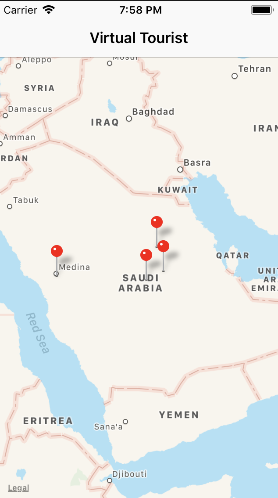
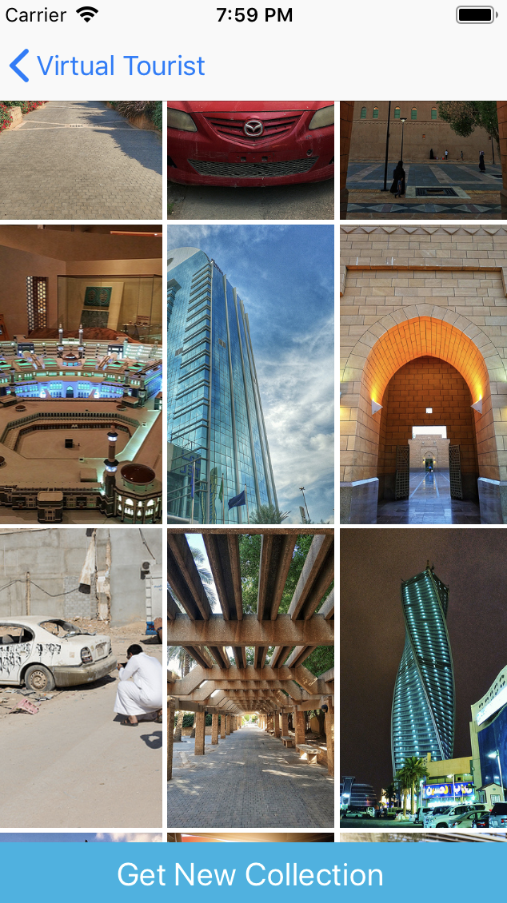
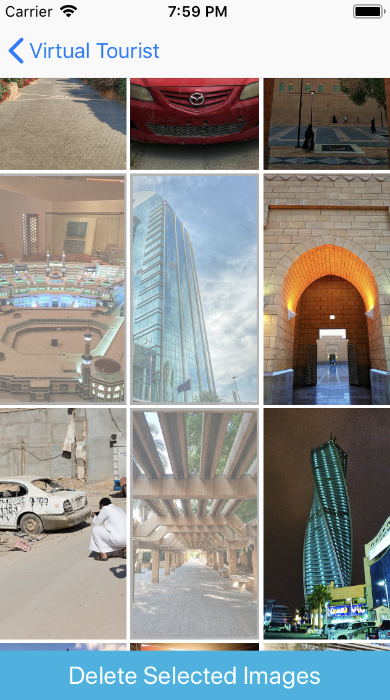

# VirtualTourist
The Virtual Tourist app downloads and stores images from Flickr. The app allows users to drop pins on a map, as if they were stops on a tour. Users will then be able to download pictures for the location and persist both the pictures, and the association of the pictures with the pin.

## How to run
* Download or clone repo 
* open VirtualTourist.xcworkspace file
* run

## How to use
* long press on any place on the map
* select the droped pin
* view downloaded images
* get new collections if you want!
* select images to delete them

## API
* Flickr

## Libraries
* Kingfisher : https://github.com/onevcat/Kingfisher
* Alamofire: https://github.com/Alamofire/Alamofire/blob/master/Documentation/Usage.md
* UIEmptyState: https://github.com/luispadron/UIEmptyState/blob/master/Example/UIEmptyStateExample/EmptyStateTableViewController.swift

## Screen Shots

